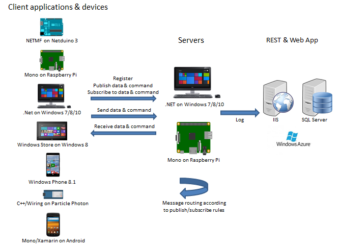
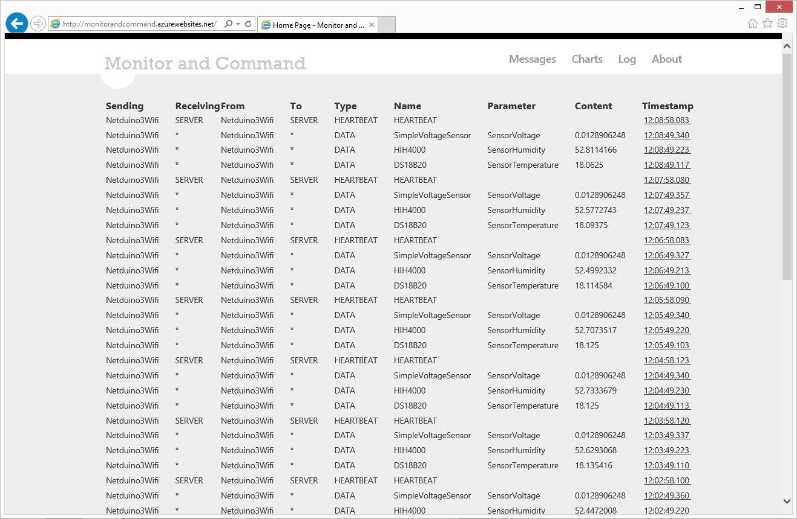
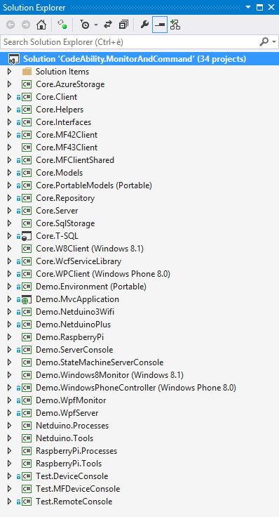

The "Monitor and Command" solution builds client/server libraries providing "monitor and command" messaging for embedded projects using .NET/NETMF/Mono.

# Overview

The Visual Studio 2013 / .NET 4.5 solution building this middleware features :
* Core projects, providing the .NET/Mono server and .NET/NETMF/Windows Phone 8 client libraries;
* Test projects, using the core libraries in server/device/remote console applications for testing/prototyping purposes;
* Demo projects, showcasing the use of the core libraries to define Netduino, Raspberry Pi, WPF & Windows Phone applications communicating through the .NET/Mono server.

Xamarin being integrated in Visual Studio 2015 Community Edition, it's now possible to develop for Android & iOS devices .NET/C# applications that integrate the Client library.

C++/Wiring "client" code is available for devices like Particle's Photon.
http://github.com/codeabilitynet/monitorandcommandclientforparticlephoton



# Showcase videos

[](http://www.youtube.com/watch?v=WXMblAWa_RQ)

Short demo video showcase the use of the core libraries to provide monitoring and commanding between the server, running on:
* Windows (https://youtu.be/uIvmFdClZJ4) or;
* a Raspberry Pi 2 with Mono (https://youtu.be/siU3eFwBiak);
using the .NET/Mono server library to handle connections and to route messages between devices:
* a Netduino Plus using the NETMF client to send random data (faking data generated by a sensor) and to receive commands to light on/off LEDs (https://youtu.be/uIvmFdClZJ4);
* a Netduino 3 Wifi sending the temperature read by a DS18B20 sensor (https://youtu.be/S69T4bpdfsU) or controlling the voltage applied to a LED with a MCP 4921 (https://youtu.be/srGZ8fE9hNs);
* a Raspberry Pi using the .NET/Mono client to send the status the LEDs of it's Pibrella board (https://youtu.be/-u_burGlGyk);
* a Raspberry Pi 2 using the .NET/Mono client to send random data (https://youtu.be/rHzfAcbFsg0);
* a Windows Phone using the WP client to receive the messages sent by some of the above devices and to send them back commands (https://youtu.be/uIvmFdClZJ4);
* a WpfMonitor application using the .NET/Mono client to present the data received from all devices on a WPF UI;
* a Surface RT tablet using the W8 client to receive all the messages exchanged by the server and several devices and present them on a XAML UI https://youtu.be/jgTgU7ul_Jo.

Additionnaly, an ASP.NET MVC application logs, through a WCF service called by the server, all the messages received by the server.



# Visual Studio Solution

Detailed description of the solution : https://monitorandcommand.codeplex.com/SourceControl/latest#CodeAbility.MonitorAndCommand/Projects.txt



# "How to" Documentation

## Adding messaging capabilities to your projects

To add "server" capabilities to your .NET/Mono project, reference the CodeAbility.Core.Server library, instanciate a MessageListener object and start listening for messages using the StartListening() method.

* public MessageListener(string ipAddress, int portNumber, int heartbeatPeriod, bool isMessageServiceActivated)
* public void StartListening()

```c#
MessageListener listener = new MessageListener(ipAddress, portNumber, heartbeatPeriod, false);
listener.StartListening();
```

N.B. The machine running the Server may have several IP addresses (e.g. internal, external...). Therefor, the one to be used shall be specified (e.g. 192.168.178.20).

To add "client" capabilities to your .NET/Mono project, reference the CodeAbility.Core.Client library and the CodeAbility.Core.Models, and instanciate a MessageClient object, start the communication using the Start method.   
* public MessageClient(string deviceName)
* public void Start(string ipAddress, int port)
* public void Stop()

```c#
MessageClient client = new MessageClient(Devices.PIBRELLA);
client.Start(ipAddress, portNumber);
```

They then use the following methods to publish/subscribe to commands and data.
* public void PublishCommand(string toDevice, string commandTarget, string commandName)
* public void PublishData(string toDevice, string dataSource, string dataName)
* public void SubscribeToData(string fromDevice, string dataSource, string dataName)
* public void SubscribeToCommand(string fromDevice, string commandName, string commandTarget)
* public void SubscribeToServerState(string stateName)
* public void SubscribeToTraffic(string fromDevice, string toDevice)
* public void Unsubscribe(string fromDevice, string publicationElement, string publicationName)

```c#
client.PublishData(Devices.ALL, Pibrella.OBJECT_RED_LED, Pibrella.DATA_LED_STATUS);
client.PublishData(Devices.ALL, Pibrella.OBJECT_BUTTON, Pibrella.DATA_BUTTON_STATUS);

client.SubscribeToCommand(Devices.ALL, Pibrella.OBJECT_RED_LED, Pibrella.COMMAND_TOGGLE_LED);
client.SubscribeToCommand(Devices.ALL, Pibrella.OBJECT_BUTTON, Pibrella.COMMAND_BUTTON_PRESSED);
```

In the above example, devices, sources/targets, data and command names are strings that have been defined in a dedicated _Environment_ namespace.


```c#
    public class Devices
    {
        public const string ALL = "*";
        public const string NETDUINO = "Netduino";
        public const string PIBRELLA = "Pibrella";
        public const string WINDOWS_PHONE = "WindowsPhone";
        public const string WPF_MONITOR = "WpfMonitor";
    }
```

```c#
  public static class Pibrella
    {
        //Object, source or target
        public const string OBJECT_RED_LED = "RedLED";
        public const string OBJECT_YELLOW_LED = "YellowLED";
        public const string OBJECT_GREEN_LED = "GreenLED";
        public const string OBJECT_BUTTON = "Button";

        //Command
        public const string COMMAND_TOGGLE_LED = "ToggleLED";
        public const string COMMAND_BUTTON_PRESSED = "ButtonPressed";

        //Data
        public const string DATA_LED_STATUS = "LEDStatus";
        public const string DATA_BUTTON_STATUS = "ButtonStatus";

        //Content
        public const string CONTENT_LED_STATUS_ON = "On";
        public const string CONTENT_LED_STATUS_OFF = "Off";
        public const string CONTENT_BUTTON_PRESSED = "Pressed";
    }
```

In the _PublishData_ & _PublishCommand_ methods, in the _toDevice_ argument :
* set "*" to allow any device;
* set a given device's name to allow only that given device;
to subscribe to that data or command.

Similarly, in the _SubscribeToData_ & _SubscribeToCommand_ methods, in the _fromDevice_ :
* set "*" to accept data or commands from all devices;
* set a given device's name to accept data or command only from that device.

To send data & command, use the following : 
* public void SendCommand(string toDevice, string commandName, string commandTarget, object commandValue)
* public void SendData(string toDevice, string dataName, string dataSource, object dataValue)

```c#
client.SendData(Devices.ALL, 
                       Pibrella.OBJECT_RED_LED, 
                       Pibrella.DATA_LED_STATUS, RedLedStatus ? 
                            Pibrella.CONTENT_LED_STATUS_ON :
                            Pibrella.CONTENT_LED_STATUS_OFF);
```

Similarly to add client capabilities : 
* to a WindowsPhone project, reference the CodeAbility.MonitoringAndCommand.WPClient and CodeAbility.MonitoringAndCommand.PortableModels libraries;
* to a NETMF project, reference the CodeAbility.MonitorAndCommand.MFClient library (that directly embeds the needed Models classes).

To received command and data to which you subscribed, register the appropriate event handler (there are two, one for commands, one for data.

```c#
{
    ...
    messageClient.CommandReceived += client_CommandReceived;
    ...      
}

void client_CommandReceived(object sender, MessageEventArgs e)
{
    string commandName = e.Name; 
    string parameter = e.Parameter.ToString();
    string content = e.Content.ToString();

    if (commandName.Equals(Environment.Pibrella.COMMAND_TOGGLE_LED))
    {
        if (parameter.Equals(Environment.Pibrella.OBJECT_GREEN_LED))
	    ToggleGreenLed();
        else if (parameter.Equals(Environment.Pibrella.OBJECT_YELLOW_LED))
	    ToggleYellowLed();
        else if (parameter.Equals(Environment.Pibrella.OBJECT_RED_LED))
	    ToggleRedLed();
    }
    else if (commandName.Equals(Environment.Pibrella.COMMAND_BUTTON_PRESSED))
    {
        ToggleRunningState();
    }
}
```

The CodeAbility.Test.* console Server, Device & Remote projects illustrate such use in more details.

## Extending the server's functionality

The server's functionality can be extended though inheritance. The PostProcess() method of the ServiceListener class can be overriden to had special processing of the messages after the base routing functionality. This can be use, for instance, to define state machines that will, based on the messages received, compute states and trigger commands sent to the connected device, as illustrated in the Windows 8 demo ([url:https://youtu.be/jgTgU7ul_Jo]).

[ExtendedMessageListener.cs]
(http://monitorandcommand.codeplex.com/SourceControl/latest#CodeAbility.MonitorAndCommand/StateMachineServerConsole/ExtendedMessageListener.cs)

## Communication and Message format

Clients and Server communicate using simple sockets. 

Messages are exchanged using JSON, with the following format : 
```c#
{ 
  "SendingDevice":"[Name of the sending device]",
  "ReceivingDevice":"[Name of the receiving device]",
  "FromDevice":"[Name of the originator device]",
  "ToDevice":"[Name of the destination device]",
  "ContentType":[0 for Infrastructure, 1 for Command, 2 for Data messages],
  "Name":"[Name of the command or data]",
  "Parameter":"[Command parameter name or data source name]",
  "Content":"[Command parameter value or data value]",
  "Timestamp":"[DateTime timestamp]"
}
```

Sending/Receiving devices may be distinct from To/From devices to allow some clients to "listen/spy on" messages that are not normally destined to them, allowing for the development of specific monitoring clients (see the WPFClient project as an example).

## Internals

### Multithreading 

The server uses :
* one thread for each connected client;
* one thread for processing received messages;
* one thread for sending messages to subscribing clients.

Received messages are added to a ConcurrentQueue. The content of that queue is analyzed by the Processor thread that, based on the routing rules derived from the publish/subscribe messages received from client, will add the messages to a ConcurrentQueue handled by the Sender thread.

Communication between receiving, Processor and Sender threads is ensured by ManualResetEvent objects.

[MessageListener.cs](http://monitorandcommand.codeplex.com/SourceControl/latest#CodeAbility.MonitorAndCommand/CoreServer/MessageListener.cs)

The clients use a Sender and Receiver threads for sending and receiving messages in a similar fashion.

#### Messages routing

Within the server, Register/Unregister messages are used maintain a list of connected *Device*s, while Publish/Subscribe messages are used to build and maintain a list of *Rule*s defining which device can send/receive commands/data. 

When a message is received, the *RulesManager* checks _fromDevice & _toDevice_ properties values against all rules to build the list of *Device*s to which that message shall be "routed". 

[Device.cs](http://monitorandcommand.codeplex.com/SourceControl/latest#CodeAbility.MonitorAndCommand/CoreServer/Device.cs)
[Rule.cs](http://monitorandcommand.codeplex.com/SourceControl/latest#CodeAbility.MonitorAndCommand/CoreServer/Rule.cs)
[RulesManager.cs](http://monitorandcommand.codeplex.com/SourceControl/latest#CodeAbility.MonitorAndCommand/CoreServer/RulesManager.cs)


